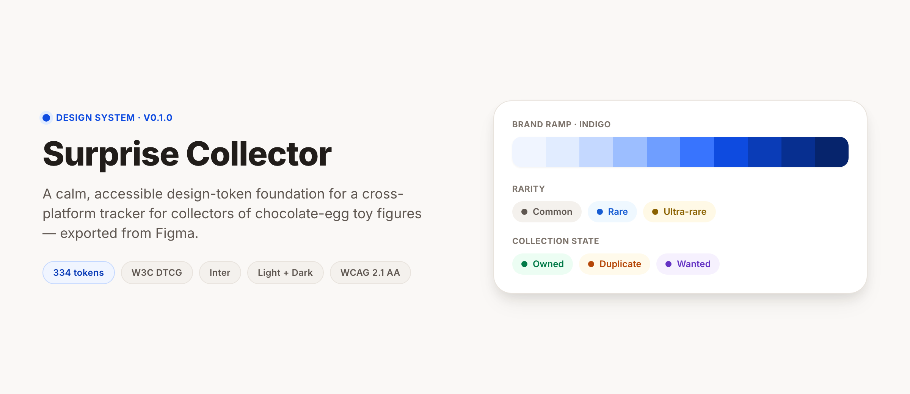

# Surprise Collector — Design System

**The colour, type, spacing and elevation foundation for a cross-platform app
that helps people track their collection of chocolate-egg toy figures —
exported straight from Figma as W3C design tokens.**


[**▶ Live styleboard**](https://eugene-jet.github.io/mobile-app/) · [Figma file](https://www.figma.com/design/kbZ39m2G2qM7misMz37XF6) · [Product concept](idea.md)

[](https://eugene-jet.github.io/mobile-app/)

> **[▶ Explore the full styleboard](https://eugene-jet.github.io/mobile-app/)** — every ramp, the
> collection semantics, the type scale, corner radii, spacing, elevation and a light/dark
> collectible card, all rendered from [`tokens.json`](tokens.json).

This repository is the **design output** for the product, not the app itself.
There is no application code yet: it holds the product concept and a Figma-sourced
design system — foundations and base components, no product screens. Figma is the
source of truth for anything visual; `tokens.json` is its machine-readable export.

Working name: **Surprise Collector**. The app deliberately avoids the Kinder and
Ferrero trademarks in its name and visual identity.

## What's inside

- **334 design tokens** in [W3C Design Tokens](https://tr.designtokens.org/format/)
  (DTCG) draft format, exported from Figma.
- **Light and dark themes**, designed together as one semantic layer over shared
  primitive ramps.
- **Collection semantics** — domain tokens the product speaks in: rarity
  (common / rare / ultra-rare), collection state (owned / duplicate / wanted)
  and status (info / success / warning / danger).
- **A full type scale** on Inter, a 4px spacing grid, a seven-step radius scale
  and four elevation levels.
- **Accessible by construction** — WCAG 2.1 AA on every foreground/background
  pair, touch targets at or above 44px.

## Design system

The design system lives in Figma and is the source of truth for anything visual:

**[Surprise Collector — Design System](https://www.figma.com/design/kbZ39m2G2qM7misMz37XF6)**

It covers foundations and base components — no product screens yet.

| | |
|---|---|
| Themes | Light and dark, designed together |
| Breakpoints | 375 (mobile) · 768 (tablet) · 1440 (wide) |
| Platforms | One component set for iOS, Android and web |
| Typeface | Inter |
| Icons | [Lucide](https://lucide.dev) (ISC) |
| Accessibility | WCAG 2.1 AA — every foreground/background pair verified |

The Figma file is organised as: cover, four foundations pages (colour, typography,
scale and layout, elevation), an icon page, then one page per component, and a
changelog.

## tokens.json

[`tokens.json`](tokens.json) is the exported machine-readable copy of the Figma
variables, in [W3C Design Tokens](https://tr.designtokens.org/format/) draft format.
334 tokens.

```
primitive/     raw colour ramps — never referenced directly by UI code
color/         light and dark semantic colours, aliased to primitives
spacing/       4px-grid spacing scale
radius/        corner radii — buttons use radius.sm (8px), fields radius.md (12px)
size/          icon, avatar and control sizes (touch-min = 44px)
stroke/        border widths
layout/        responsive values, one group per breakpoint
font/          families, weights, sizes, line heights
typography/    composite text styles
shadow/        elevation levels
```

### Corner radii

Every row below is the radius the Figma component library actually binds, not an
intent — the components are the source of truth for this mapping.

| Token | Value | Used for |
|---|---|---|
| `radius.none` | 0px | Full-bleed surfaces — List Row, Top App Bar, dividers |
| `radius.sm` | 8px | Button (all 48 variants), Skeleton line |
| `radius.md` | 12px | Text Field, Select, Textarea, Side Nav Item, List Row thumbnail, the button focus ring |
| `radius.lg` | 16px | Card, Collectible Card, Toast, Skeleton block |
| `radius.xl` | 24px | Bottom Sheet, Dialog |
| `radius.2xl` | 32px | Reserved — no component uses it yet |
| `radius.full` | 9999px | Chip, Badge, Avatar, progress track and fill, Skeleton circle |

Buttons share a single radius across all sizes, so a small and a large button read as
the same family. The focus ring sits 4px outside the button and uses `radius.md` (12px)
to stay concentric with it. Chip and Badge are the only fully pill-shaped controls.

Controls and containers deliberately sit on different steps: a button is 8px, the
field it sits next to is 12px, and the card holding both is 16px, so nesting reads as
three distinct levels rather than one repeated shape.

Semantic colours are aliases, so a theme is a single lookup table:

```json
"color": {
  "light": { "bg": { "canvas": { "$type": "color", "$value": "{primitive.neutral.50}" } } },
  "dark":  { "bg": { "canvas": { "$type": "color", "$value": "{primitive.neutral.950}" } } }
}
```

Consume it with Style Dictionary or any DTCG-compatible transformer to produce CSS
custom properties, Kotlin, or Swift. Regenerate it from Figma rather than editing it
by hand — Figma is the source of truth.

## Status

Design foundations are in place; application development has not started.

- **Done** — colour (light + dark), typography, spacing, radius, elevation and
  base components in Figma, exported to `tokens.json`.
- **Planned MVP** (see [idea.md](idea.md)) — catalogue, my collection, wishlist.
  Trading, selling and community features are explicitly out of scope for the
  first stage.
- **Stack** — not chosen yet; React Native and Flutter are the candidates.

## Repository contents

| File | What it is |
|---|---|
| [`tokens.json`](tokens.json) | 334 design tokens, W3C DTCG format, exported from Figma |
| [`docs/index.html`](docs/index.html) | The live styleboard rendered from the tokens |
| [`idea.md`](idea.md) | Product concept and planned MVP scope (in Ukrainian) |
| [`CLAUDE.md`](CLAUDE.md) | Working guidance for this repository |
